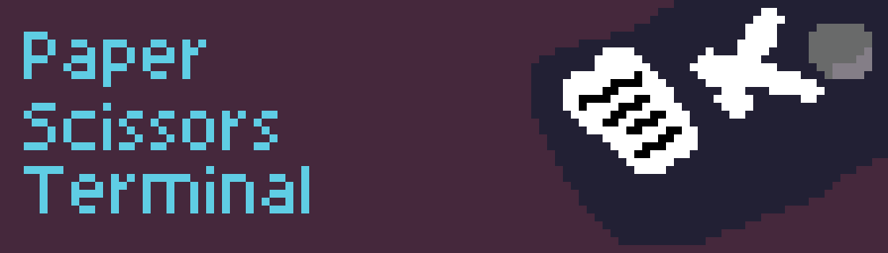

# Paper Scissors Terminal



_Make it so you have to play paper scissors rock to run commands._

```
➜  paper-scissors-rock git:(main) ✗ ./result/bin/paper-scissors-terminal --help
Play paper scissors rock to be able to use the terminal.
Choose [P, S, R] to guess.


Usage: paper-scissors-terminal <COMMAND>...

Arguments:
  <COMMAND>...

Options:
  -h, --help     Print help
  -V, --version  Print version

```

This was made to learn how clap worked.
